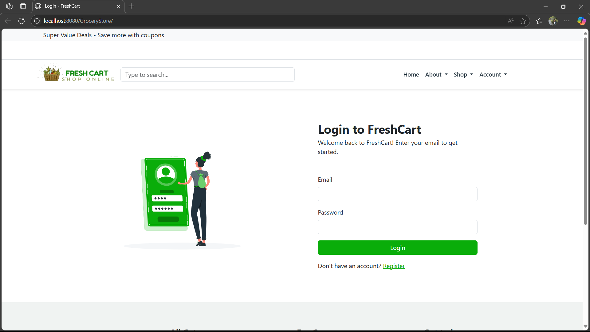
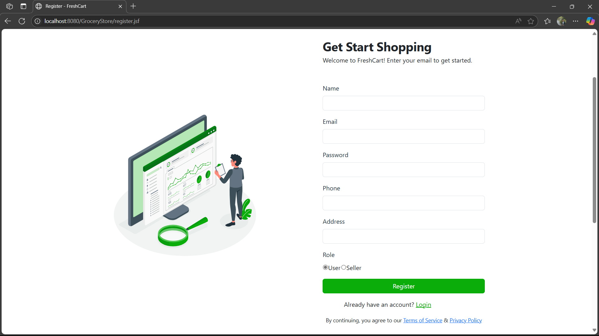
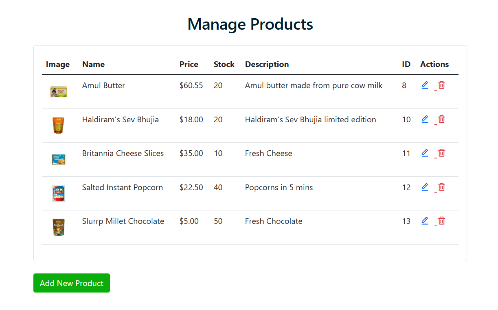
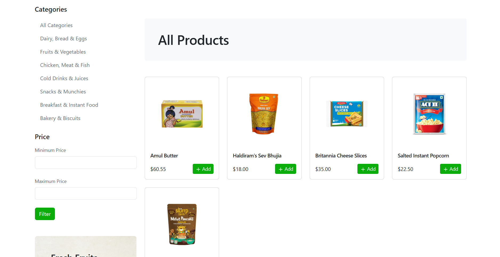

# GroceryStore - Online Grocery Shopping Platform

## Project Overview
GroceryStore is a web-based application built using Java and Jakarta EE for managing an online grocery store. It supports user registration, product browsing, cart management, checkout, and order tracking, with additional features for sellers to manage categories and products.

## Technologies Used
- **IDE**: NetBeans IDE 25
- **Database**: MySQL (via XAMPP)
- **Application Server**: Payara Server 6.2025.2
- **Framework**: Jakarta EE 10
- **Java Version**: Java 17
- **Frontend**: JSF (JavaServer Faces) with PrimeFaces, HTML, CSS, JavaScript
- **Backend**: Maven, REST APIs, EJBs
- **Other Tools**: phpMyAdmin (for database management)

## Prerequisites
Before running the project, ensure you have the following installed:
- NetBeans IDE 25
- XAMPP (with MySQL and phpMyAdmin)
- Payara Server 6.2025.2
- Java Development Kit (JDK) 17
- Maven (included with NetBeans)

## Setup Instructions
Follow these steps to set up and run the project:

1. **Database Setup**:
   - Start XAMPP and ensure MySQL is running.
   - Open phpMyAdmin (`http://localhost/phpmyadmin`).
   - Create a new database named `project`.
   - Import the `project.sql` file (located in the project root) into the `project` database:
     - In phpMyAdmin, select the `project` database.
     - Click the **Import** tab, choose `project.sql`, and click **Go**.

2. **Open the Project in NetBeans**:
   - Launch NetBeans IDE 25.
   - Select **File** > **Open Project** and navigate to the `GroceryStore` project directory.
   - Open the project.

3. **Database Connection in NetBeans**:
   - In the **Services** panel, right-click **Databases** > **New Connection**.
   - Select **MySQL (Connector/J driver)**, and enter:
     - Host: `localhost`
     - Port: `3306`
     - Database: `project`
     - Username: `root` (or your MySQL username)
     - Password: (leave blank for default XAMPP setup or enter your MySQL password)
   - Test the connection and click **Finish**.

4. **Configure Payara Server**:
   - Start Payara Server:
     - In the **Services** panel, expand **Servers**, right-click **Payara Server**, and select **Start**.
   - Open the Payara Admin Console:
     - Navigate to `http://localhost:4848` in your browser.
   - Create a Connection Pool:
     - In the Admin Console, go to **Resources** > **JDBC** > **JDBC Connection Pools** > **New**.
     - Enter:
       - Pool Name: `projectPool`
       - Resource Type: `javax.sql.DataSource`
       - Database Driver Vendor: `MySQL`
     - Click **Next**, then add properties:
       - `URL`: `jdbc:mysql://localhost:3306/project?useSSL=false`
       - `User`: `root`
       - `Password`: (your MySQL password, if any)
     - Click **Finish**, then **Ping** to test the connection.
   - Create a JDBC Resource:
     - Go to **Resources** > **JDBC** > **JDBC Resources** > **New**.
     - Enter:
       - JNDI Name: `jdbc/project`
       - Pool Name: `projectPool`
     - Click **OK**.

5. **Run the Project**:
   - In NetBeans, right-click the project in the **Projects** panel and select **Run**.
   - The application will deploy to Payara Server and open in your default browser (e.g., `http://localhost:8080/GroceryStore`).

## Project Structure
- `src/main/java`: Contains Java source code, including:
  - EJBs (`EJB/`): Business logic for cart, orders, products, etc.
  - JSF Controllers (`JSF/`): Managed beans for UI interactions.
  - REST APIs (`api/`): Endpoints for cart, orders, and seller operations.
  - DTOs (`dto/`): Data transfer objects.
  - Entities (`Entity/`): JPA entities for database mapping.
- `src/main/webapp`: Contains web resources:
  - JSF pages (`.xhtml`): UI pages like `home.xhtml`, `shop.xhtml`, etc.
  - `resources/`: CSS, JavaScript, images, and other static assets.
- `pom.xml`: Maven configuration with dependencies.
- `project.sql`: Database schema and initial data.

## Screenshots
Below are screenshots of key pages in the application:

### Login Page


### Register Page


### Manage Product


### Shop Page


### Cart Page


## Troubleshooting
- **Database Connection Errors**: Ensure MySQL is running in XAMPP and the `project` database is imported correctly.
- **Payara Server Issues**: Verify Payara is running and the connection pool pings successfully in the Admin Console.
- **Build Errors**: Clean and build the project in NetBeans (`Right-click project > Clean and Build`) to resolve Maven dependency issues.
- **Line Ending Warnings**: If Git shows LF/CRLF warnings, run:
  ```bash
  git config --global core.autocrlf true
  ```

## Contributing
To contribute to this project:
1. Fork the repository on GitHub.
2. Clone your fork locally:
   ```bash
   git clone https://github.com/your-username/GroceryStore-REST-API-using-JAVA.git
   ```
3. Create a new branch:
   ```bash
   git checkout -b feature/your-feature
   ```
4. Make changes, commit, and push:
   ```bash
   git add .
   git commit -m "Add your feature"
   git push origin feature/your-feature
   ```
5. Open a pull request on GitHub.

## License
This project is licensed under the MIT License. See the [LICENSE](LICENSE) file for details.

## Contact
For questions or support, contact the project maintainer @ [ujjvalpatel210@gmail.com].